# 🚀 Machine Learning Bootcamp | Armenian Code Academy (ACA)

A premium, comprehensive repository designed for the Machine Learning Bootcamp at **Armenian Code Academy (ACA)**. This repository serves as a centralized hub hosting structured lecture classwork, hands-on homework assignments, evaluation quizzes (featuring automated grading engines), competitive Kaggle challenges, and curated external learning materials.

---

## ⚡ TL;DR (Too Long; Didn't Read)

* **Objective:** Hands-on curriculum to transition ACA students from Python/SQL foundations to Classical Machine Learning, Deep Learning (PyTorch & TensorFlow), and competitive data science.
* **Core Stack:** Python 3.13+, PyTorch, TensorFlow, Scikit-Learn, Pandas, Seaborn, SQL, and `uv` package manager.
* **Repo Highlights:** 
  * 📅 **14+ Lecture Modules** (`current/classwork/`) spanning from exploratory data analysis to complex model pipelines.
  * 📝 **15+ Practical Homeworks** (`Homeworks/`) focusing on end-to-end ML model creation, feature engineering, and mathematics.
  * 📊 **SQL Foundations** (`SQL/`) for database interaction and data munging.
  * 🧠 **Specialized Curriculums** (`materials/`) incorporating Andrew Ng's Coursera ML and Deep Learning Specialization courses.
  * 🏆 **Quizzes & Grading Automation** (`quizzes/`) with programmatic grader scripts (`grader.py`, `grade-submissions.py`) to easily evaluate student work.

---

## 🗺️ Repo Structure & Flow

Below is the conceptual architecture of the ACA Machine Learning Bootcamp repository:

```mermaid
graph TD
    %% Base Workspace Nodes
    Root["📁 ml-bootcamp (Root)"]
    Current["📁 current/ (Classwork & Lectures)"]
    Homeworks["📁 Homeworks/ (Practice & Tasks)"]
    Quizzes["📁 quizzes/ (Evaluation & Grading)"]
    SQL["📁 SQL/ (Database Foundations)"]
    Kaggle["📁 kaggle/ (Competitions & Projects)"]
    Materials["📁 materials/ (Deep Dive References)"]

    %% Core Root Links
    Root --> Current
    Root --> Homeworks
    Root --> Quizzes
    Root --> SQL
    Root --> Kaggle
    Root --> Materials

    %% Current Sub-Nodes
    Current --> Classwork["📁 classwork/ (Chronological Notebooks)"]
    Current --> Extra["📁 extra/ (Supplementary Work)"]
    Current --> Initial["📁 initial/ (Boilerplates)"]

    %% Quizzes Sub-Nodes
    Quizzes --> Q1["📁 quiz1/ (Automated Evaluation)"]
    Quizzes --> Q2["📁 quiz2/ (Python Grader Ecosystem)"]
    Quizzes --> Q3["📁 quiz3_ml/ (Regression, Classification & Clustering)"]
    Quizzes --> Exam["📄 exam.ipynb (Comprehensive Assessment)"]

    %% Materials Sub-Nodes
    Materials --> NgML["📁 Machine-Learning-Specialization"]
    Materials --> NgDL["📁 coursera-deep-learning-specialization"]
    Materials --> PDSH["📁 PythonDataScienceHandbook"]
    Materials --> Slides["📁 python-data-science-slides"]

    %% Styles
    classDef default fill:#1e293b,stroke:#475569,stroke-width:2px,color:#f8fafc;
    classDef accent fill:#0f172a,stroke:#38bdf8,stroke-width:2px,color:#38bdf8;
    classDef file fill:#334155,stroke:#94a3b8,stroke-width:1px,color:#f1f5f9;
    
    class Root,Current,Homeworks,Quizzes,SQL,Kaggle,Materials accent;
    class Exam file;
```



---

## 📂 Detailed Directory Overview

| Directory | Purpose | Key Content & Technologies |
| :--- | :--- | :--- |
| **`current/classwork/`** | Chronological lecture notebooks matching class progression. | Data preprocessing, plotting, Numpy, Pandas, Scikit-Learn pipelines. |
| **`Homeworks/`** | Progressive student assignments designed to build muscle memory. | Homeworks 6–20 covering data wrangling, optimization, and training loops. |
| **`quizzes/`** | Examination suites and programmatic grading utilities. | Submissions, golden answers, automated grading engines (`grader.py`). |
| **`SQL/`** | Structural database query classwork. | Relational queries, joins, aggregations, data analysis via SQLite/PostgreSQL. |
| **`kaggle/`** | Advanced end-to-end competition work. | Predicting customer churn (`churn-predication.ipynb`), movie recommendations. |
| **`materials/`** | Deep reference guides, slides, and industry-standard specializations. | Coursera Machine Learning and Deep Learning Specialization materials. |

---

## 🎯 Purpose of the Bootcamp

The primary objective of this repository is to build a robust, scalable environment for ACA students to master Machine Learning. The curriculum is constructed with three pillars:

1. **Rigorous Theory into Practice:** Rather than just learning ML math, students implement algorithms using Jupyter Notebooks (`.ipynb`) with real-world datasets (e.g., California Housing, Wine UCI, Heart Disease, Credit Card customer profiles).
2. **Modern Tooling & Environments:** Students learn to use industry-standard libraries including **PyTorch** and **TensorFlow** within isolated, reproducible Python environments managed by `uv` or `pip`.
3. **Continuous, Metric-Driven Feedback:** The quiz infrastructure provides clear, actionable feedback to students on crucial ML topics (e.g., handling target imbalance, model regularization, dimensionality reduction with PCA, clustering validation, and pipeline-based standard scaling).

---

## 💡 Instructor Focus: Grading Automation

One of the standout features of this repository is the automated grading framework situated inside the `quizzes/` folder:

* **Quiz 1 (`quiz1/`):** Contains `grade-submissions.py` which aggregates student answers, parses notebook cells, and generates a structured `MASTER_GRADE_REPORT.md` file along with customized zip folders containing feedback for each student.
* **Quiz 2 (`quiz2/`):** Utilizes `grader.py` against a static `golden_answers.py` solution script, rendering unique detailed reports (`GRADING_*.md`) and compiled `gradebook.json` results automatically.
* **Quiz 3 (`quiz3_ml/`):** Features advanced machine learning tasks (regression, classification, clustering, PCA) graded against `solutions.ipynb` generating dedicated student feedback and unified gradebooks.

---

## ⚙️ Environment Setup

This repository uses a modern Python setup powered by `uv` for lightning-fast package management and strict dependency tracking.

### Requirements
* **Python:** `>= 3.13`
* **Package Manager:** `uv` (Recommended) or `pip`

### Initializing the Environment

1. **Clone the repository:**
   ```bash
   git clone <repository-url>
   cd ml_bootcamp
   ```

2. **Sync the dependencies (using `uv`):**
   ```bash
   # This will automatically download Python 3.13 (if missing), create a .venv, and sync lockfile dependencies
   uv sync
   ```

3. **Activating the Environment:**
   * **On macOS/Linux:**
     ```bash
     source .venv/bin/activate
     ```
   * **On Windows:**
     ```bash
     .venv\Scripts\activate
     ```

### Core Dependencies Installed
The environment comes pre-packaged with the entire standard data science and machine learning ecosystem:
* **Deep Learning:** `torch`, `torchvision`, `tensorflow`
* **Classical ML:** `scikit-learn`
* **Data Wrangling:** `pandas`, `kagglehub`
* **Visualization:** `matplotlib`, `seaborn`

---

> [!NOTE]
> *This repository is actively maintained and updated in line with ACA's lecture and exam schedule. Students should run `git pull` regularly to sync the latest homeworks and classwork modules.*
